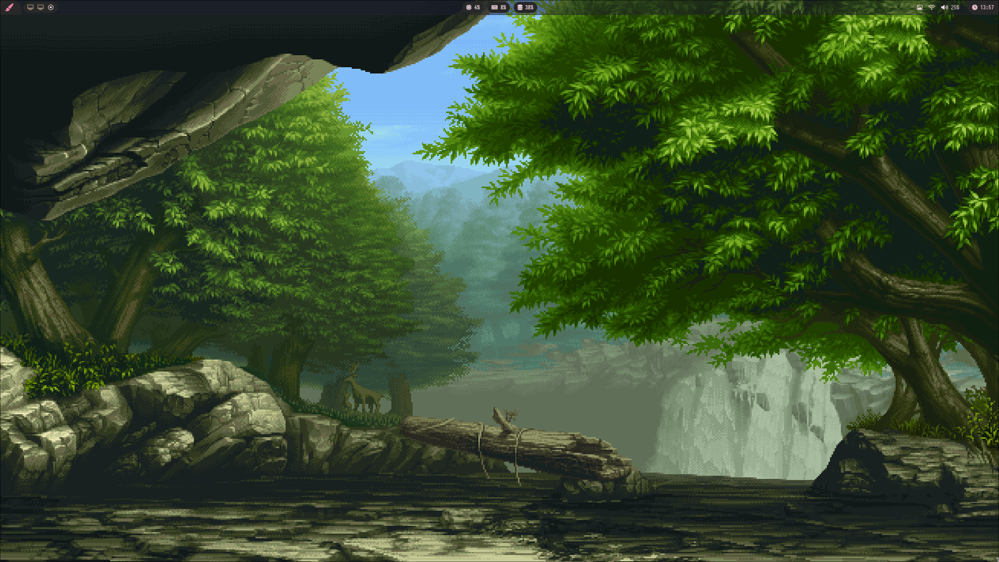
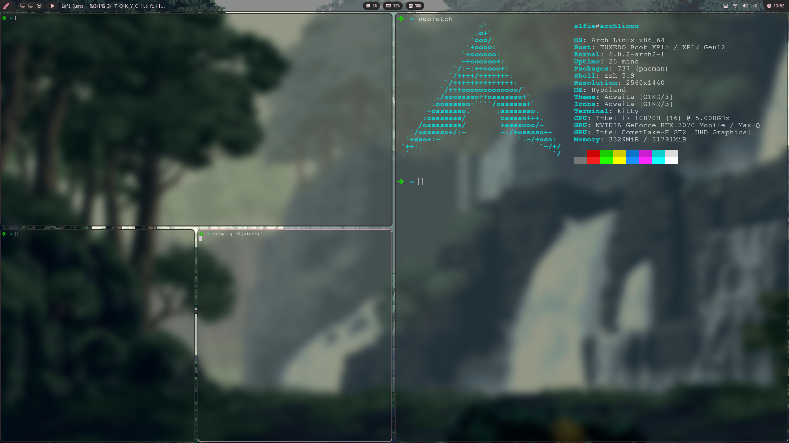
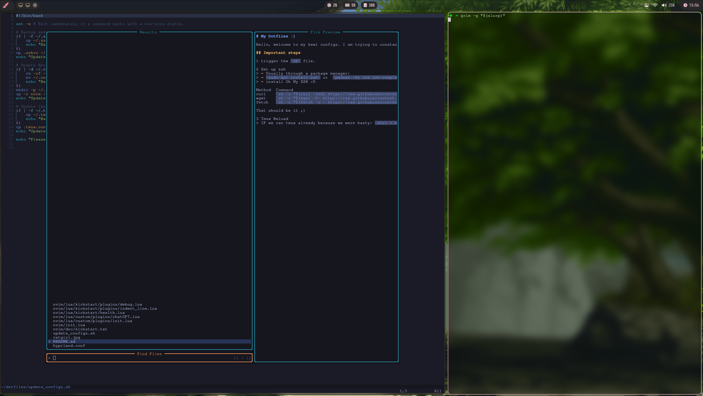

# My Dotfiles :)

Hello, welcome to my kewl configs. I am trying to constantly add things into it, sicne I discovered that reinstalling my stuff over and over was relly painful.

## Hyprland with Arch Linux

## Important steps

1 trigger the `sh` file.

2 Set up zsh
> - Usually through a package manager:
> - `sudo apt install zsh` or  `pacman -Sy zsh zsh-completions`
> - install Oh My ZSH :D

Method 	Command
curl 	`sh -c "$(curl -fsSL https://raw.githubusercontent.com/ohmyzsh/ohmyzsh/master/tools/install.sh)"`
wget 	`sh -c "$(wget -O- https://raw.githubusercontent.com/ohmyzsh/ohmyzsh/master/tools/install.sh)"`
fetch 	`sh -c "$(fetch -o - https://raw.githubusercontent.com/ohmyzsh/ohmyzsh/master/tools/install.sh)"`

That should be it ;)

3 Tmux Reload
> IF we ran tmux already because we were hasty: `ctrl + b -> kill-server`

